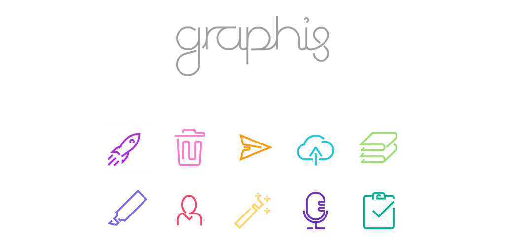

<div align="center">

</div>

---

**graphis** is a stylish icon font that is super convenient to use. Glyphs are mapped to emojis, so just drop the font and you're good to go. Want to use icons inside text? Add your text font as a fallback font, emojis are icons and the rest is normal text.

# How to Use

👉 **STEP 1**: load the icon font:
```html
<link rel="stylesheet" href="https://unpkg.com/graphis/font/graphis.css">
```
👉 **STEP 2**: set the font family on icon elements:
```css
i {
  font-family: 'graphis';

  font-style: normal; /* --> to cancel italicity of <i> elements */
  font-size: 1.5em;   /* --> this is a good idea for when you want to display icons alongside text */
}
```
👉 **STEP 3**: use the corresponding emojis to render icons:
```html
<button><i>🔒</i> Login</button>
```
